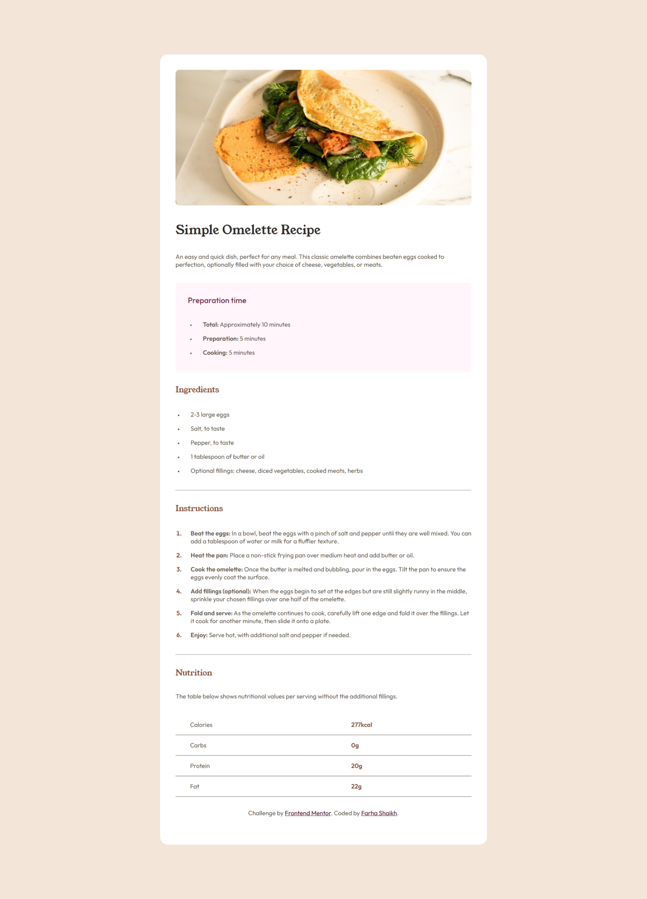

# Frontend Mentor - Recipe page solution

This is a solution to the [Recipe page challenge on Frontend Mentor](https://www.frontendmentor.io/challenges/recipe-page-KiTsR8QQKm). Frontend Mentor challenges help you improve your coding skills by building realistic projects.

## Table of contents

- [Overview](#overview)
  - [The challenge](#the-challenge)
  - [Screenshot](#screenshot)
  - [Links](#links)
- [My process](#my-process)
  - [Built with](#built-with)
  - [What I learned](#what-i-learned)
- [Author](#author)

## Overview

### The challenge

The challenge was to creata a recipe web page with responsive layout and clean code.

### Screenshot

### Links

- Solution URL: [solution URL here](https://github.com/GraceRosario/recipe-page)
- Live Site URL: [live site URL here](https://gracerosario.github.io/recipe-page/)

## My process

### Built with

- Semantic HTML5 markup
- CSS custom properties
- Flexbox

### What I learned

I learned that instead of wrapping <li> on  or other tags like that to create space between bullet and it's content, it is better to do that by giving padding left to <li>

Sometimes, giving ading in vw is better insted of setting that rem for large padding. this makes it responsive even on the smaller screens.

## Author

- Frontend Mentor - [@GraceRosario](https://www.frontendmentor.io/profile/GraceRosario)
